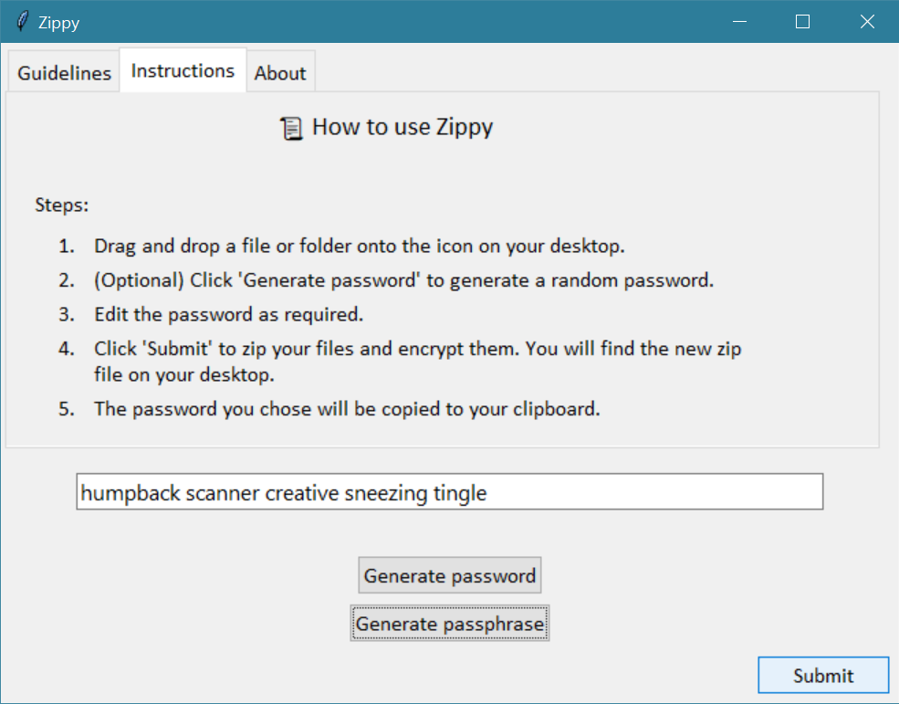

# zippy

Drag and drop shortcut to zip and encrypt. Originally built as a way to circumvent the slow load times of the WinZip GUI.

## Usage

Simply drag and drop a file or folder onto the shortcut icon. You will be prompted to enter a password or allow Zippy to generate a random one for you. The zip file will be created in the same directory as the original file.

